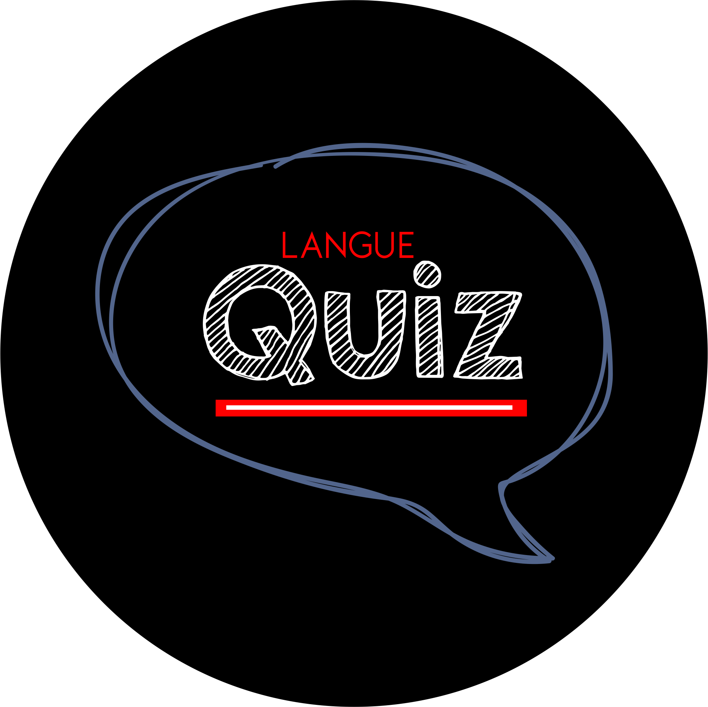
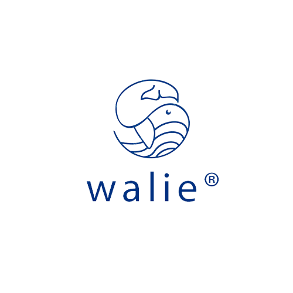

    

<h1 align="center">
   Projeto Langue Quiz 
</h1>

 Desenvolvimento de um aplicativo quiz que proporciona ao aluno, de forma interativa, a prática da Língua Inglesa quando ao mesmo tempo induz à diversão com expressões do seu contexto regional. 

## ⚙️ Desenvolvimento
1.  Módulo de acesso
    - Composto pela tela splash e seção home
2. Módulo de questões
    - Composto pela seção de questões
3. Módulo principal
    - Composto pela tela de acesso as questões
4. Módulo de retorno
    - Composto pelas telas de erro e acertos
5. Módulo de Pontos
    - Composto pela loja de pontos 

## 🚀 Time
[    Allef Kauan ](https://github.com/kaunn) | [    Emerson Silva ](https://github.com/ermelsu) | [    Inan Henrique ](https://github.com/azothi) |  [    Livia Mabelle ](https://github.com/livalves) | [    Wanessa Silva ](https://github.com/wanessacardoso)
| :---: | :---: | :---: | :---: | :---: | 

    

